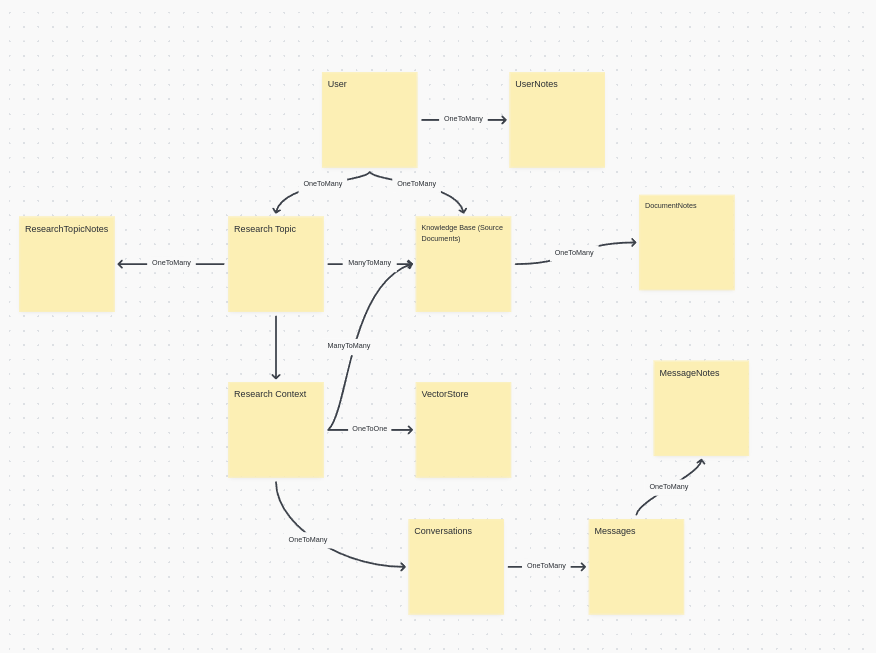

# Prada Research Agent
[](https://github.com/psf/black)

Prada RAge is a research agent that can be used to learn contexts from provided source documents and answer questions specific to that context.

## Developer Tips
### Database Models


### Autogenerate Alembic Migrations

```bash
cd tests
docker compose up -d
cd ../
alembic upgrade head
alembic revision --autogenerate -m "migration message"
cd tests
docker compose down
```

You can access `adminer` at `http://localhost:8080` to check the database. The credentials are:
```
System: PostgreSQL
Server: rage-db
Username: postgres
Password: postgres
Database: rage-test
```
## Features
### Research

#### Prepare Context
Prepare context from the source documents i.e. generate embeddings and save them in a vector index (ChromaDB).

#### Query Context
Answer questions from the prepared context.

### Data Sourcing
#### Source Google Search
Downloads results from google search and save them in a local file.
